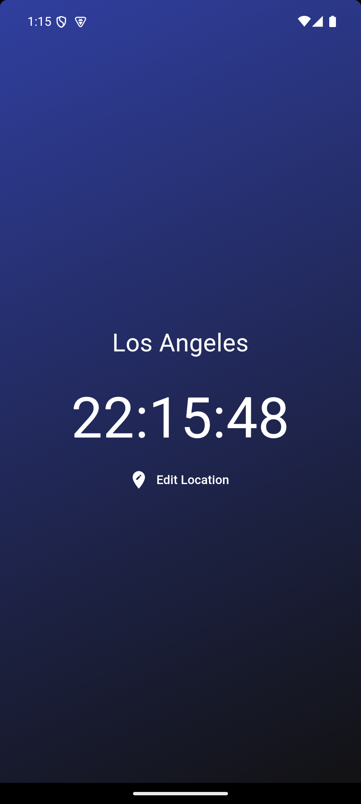

# Notes But Better

A Flutter-based application to display the current time in different locations worldwide. This app showcases clean UI design, state management, and API integration to retrieve real-time data.

## Features
- 🌐 **View time across multiple locations**
- 🕰️ **Dynamic time updates**
- 🌞🌙 **Day and night background themes based on time**
- 🎉 **Clean and user-friendly UI**

---

## Technology Used 🛠️

- **Flutter**: The UI toolkit used to build the app.  
- **Dart**: Programming language for Flutter.  
- **World Time API**: Time and location data source.  
- **GitHub**: Version control and repository hosting.  

---

## Screenshots

### Home Page Day Time


Displays a list of locations with their current times during day time.

### Home Page Night Time


Displays a list of locations with their current times during night time.

### Choose Location Page


Allows users to select a location to view its current time.

### Loading Screen


A splash/loading screen while the app fetches data.

---

## Installation 🚀
Follow these steps to set up and run the app on your local machine:

1. **Clone the repository**:
    ```bash
    git clone https://github.com/RobertGoat/clock.git
    cd clock
    ```
    
2. **Install dependencies**:
    ```bash
    flutter pub get
    ```

3. **Run the app**:
    ```bash
    flutter run
    ```

---

## Resources & Credits 🌟

- **World Time API**: [https://worldtimeapi.org](https://worldtimeapi.org)
- **Flag Icons**: [https://flagpedia.net](https://flagpedia.net)
- Special thanks to [Net Ninja's Flutter tutorials](https://www.youtube.com/user/NetNinja).This project was inspired by Net Ninja. While I followed the tutorial as a foundation, I made several customizations and improvements to suit my learning goals and to add unique features.

---

## License
This project is licensed under the MIT License. See the [LICENSE](LICENSE) file for details.
